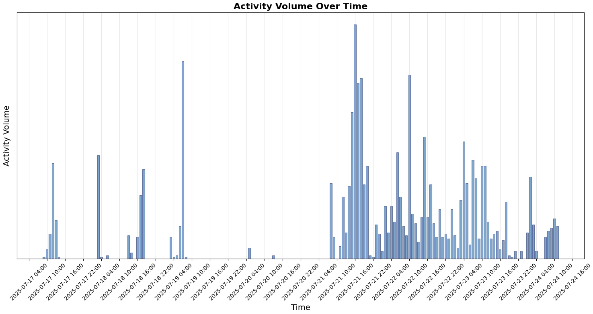
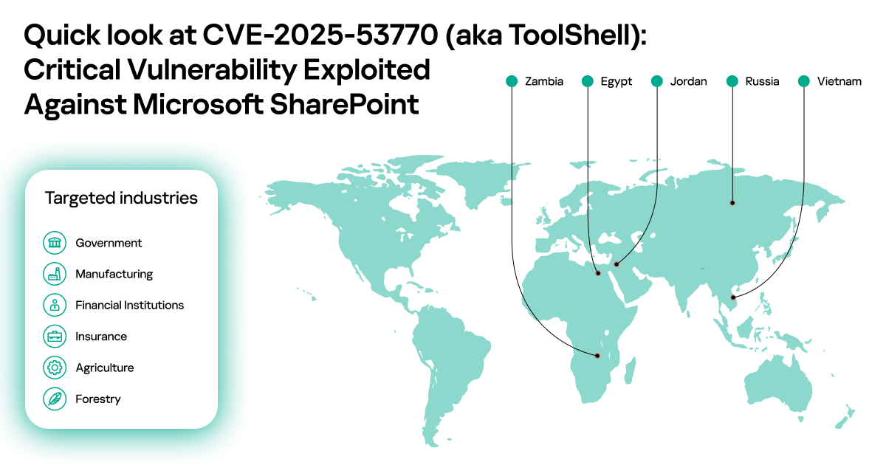

# Microsoft SharePoint Zero-Day Vulnerability: ToolShell Campaign

## Overview

In July 2025, a critical zero-day vulnerability in Microsoft SharePoint—tracked as **CVE-2025-53770**—was actively exploited in the wild as part of a widespread attack campaign dubbed **ToolShell**. This vulnerability, along with a related bypass **CVE-2025-53771**, enables unauthenticated remote code execution (RCE) and lateral movement across on-premises SharePoint environments. 

Discovered and reported by security researchers in collaboration with Microsoft’s Threat Intelligence Center (MSTIC), the vulnerability has been exploited by multiple nation-state threat actors and ransomware groups, compromising hundreds of organizations worldwide.

---

## 🔍 Vulnerability Details

- **Name:** ToolShell Campaign
- **CVE Identifiers:**
  - CVE-2025-53770 (Primary RCE vulnerability)
  - CVE-2025-53771 (Bypass path traversal vulnerability)
- **CVSS Score:** 9.8 (Critical)
- **Affected Systems:** Microsoft SharePoint Server (2016, 2019, Subscription Edition)
- **Attack Vector:** Remote / Unauthenticated
- **Type:** Remote Code Execution (RCE), Authentication Bypass, Path Traversal

### Root Cause

The primary flaw lies in the **unsafe deserialization of untrusted data**, allowing attackers to exploit SharePoint endpoints (notably `ToolPane.aspx`) to execute arbitrary code by extracting machine keys and forging session tokens. The vulnerability chain includes the ability to spoof the `Referer` header, bypassing authentication in earlier SharePoint versions.

### Discovery and Exploitation

Initially uncovered via red team engagements and security research initiatives (including Pwn2Own disclosures), exploitation of this flaw was confirmed publicly in **mid-July 2025**. Microsoft attributed the exploitation to groups such as:

- **Storm-2603**
- **Linen Typhoon** (China-linked)
- **Violet Typhoon**

The attackers leveraged this exploit to deploy **web shells**, exfiltrate credentials, and deliver **Warlock** and **Lockbit** ransomware variants.

---

## 📉 Impact

### Affected Organizations

More than **400 organizations** were reportedly compromised as part of the ToolShell campaign, including:

- U.S. Government Agencies
- Financial Institutions
- Energy Sector Firms
- Major Universities
- National Nuclear Security Administration (NNSA)

### Effects of Exploitation

- Remote code execution with **system-level privileges**
- Extraction of **SharePoint machine keys** and session hijacking
- Installation of **persistence mechanisms** (e.g., web shells)
- Deployment of **ransomware payloads**
- Lateral movement within enterprise networks

---

## 🛠️ Remediation & Mitigation

### Microsoft Patches
Microsoft released emergency patches and guidance as of **July 19–21, 2025**:

| SharePoint Version      | Patch Availability      |
|-------------------------|--------------------------|
| Subscription Edition    | July 19, 2025           |
| SharePoint 2019         | July 19, 2025           |
| SharePoint 2016         | July 26, 2025           |

🔗 [Microsoft Security Blog - CVE-2025-53770](https://msrc.microsoft.com/blog/2025/07/customer-guidance-for-sharepoint-vulnerability-cve-2025-53770/)

### Recommended Actions

- ✅ **Apply all relevant security patches immediately**
- 🛡 **Rotate SharePoint machine keys** to prevent token replay attacks
- 🔍 **Hunt for IOCs**, such as unusual access to `ToolPane.aspx`, use of `WindowsIdentity` serialization, and rogue web shells
- ⚙️ **Enable AMSI** (Antimalware Scan Interface) and Microsoft Defender ATP
- 🚫 **Isolate public-facing SharePoint servers** if patching is delayed

---

## 🧪 Indicators of Compromise (IOCs)

- Unexpected POST requests to `/layouts/ToolPane.aspx`
- Suspicious entries in SharePoint Unified Logging System (ULS)
- Creation of `.aspx` web shell files in `layouts` or custom pages directory
- Outbound connections to known C2 infrastructure linked to Lockbit/Warlock

---

## 📚 References

- [CISA KEV Catalog – CVE-2025-53770](https://www.cisa.gov/known-exploited-vulnerabilities-catalog)
- [Microsoft MSRC Guidance](https://msrc.microsoft.com)
- [The Hacker News – SharePoint Exploited in the Wild](https://thehackernews.com/2025/07/critical-microsoft-sharepoint-flaw.html)
- [Trend Micro Threat Advisory – CVE-2025-53770 and 53771](https://www.trendmicro.com)
- [ITPro Coverage – Ransomware Deployment](https://www.itpro.com/security/cyber-attacks/sharepoint-flaw-microsoft-says-hackers-deploying-ransomware)

---

## 📌 Conclusion

The ToolShell campaign underscores the critical need for timely patching and monitoring of enterprise collaboration platforms like SharePoint. CVE-2025-53770 represents a severe risk to organizations operating on-prem infrastructure and should be addressed with urgency. Patch, monitor, and isolate untrusted access paths to reduce exposure.
