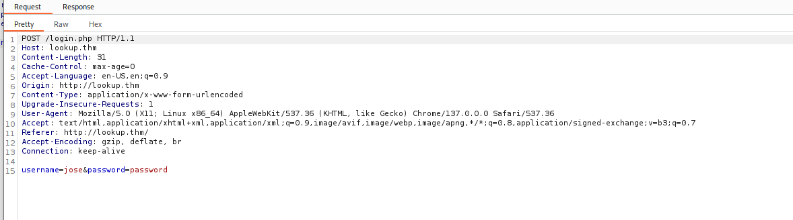
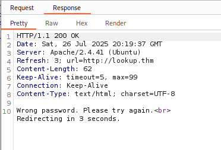

# 🔍 TryHackMe - Lookup

**Room:** Lookup  
**Platform:** TryHackMe  
**IP Address:** 10.10.56.153  
**Focus:** Enumeration, Web Exploitation, Privilege Escalation  
**Difficulty:** Easy/Medium  
**Status:** Completed ✅

---

## 🧭 Enumeration

Performed initial enumeration with Nmap:
```bash
nmap -sC -sV -p- 10.10.56.153
```

Identified open ports for SSH and HTTP.

Used **DirBuster** with the wordlist `apache-user-enum-1.txt` to enumerate directories and potential usernames.

📸 

Found `jose` as a valid user.

📸 

---

## 🔐 Web Login and Hostname Discovery

Navigated to the login page on the web server. Upon login, was redirected to:

```text
files.lookup.thm/
```

Added this domain to `/etc/hosts` for local name resolution.

📸 

📸 

---

## 🗂️ File Navigation Post-Login

After successful login, accessed the internal file management page.

📸 

Attempted to access `/home/think`, but permission was denied.

📸 

---

## 🔍 Privilege Escalation

Ran a search to find SUID binaries:

```bash
find / -perm /4000 2>/dev/null
```

📸 

Discovered `/usr/sbin/pwm` as an exploitable SUID binary.

Crafted a malicious `id` script in `/tmp/` and modified the `PATH`:

```bash
echo '#!/bin/bash' > /tmp/id
echo 'echo "uid=33(think) gid=33(think) groups=(think)"' >> /tmp/id
chmod +x /tmp/id
export PATH=/tmp:$PATH
/usr/sbin/pwm
```

📸 

Successfully escalated privileges.

---

## 🔓 SSH Brute Forcing

Performed SSH brute-force login attempts using `hydra`.

📸 

---

## 🎯 Post-Exploitation

Accessed the user’s home directory and retrieved the `user.txt` flag.

📸 

---

## 🧠 Lessons Learned

- Importance of enum tools like DirBuster and Nmap in early-stage recon
- DNS redirection handling using `/etc/hosts`
- Creative SUID exploitation via `$PATH` manipulation
- Brute-forcing SSH credentials after valid user discovery

---

## 📁 Screenshots

Screenshots related to this room are stored in [`screenshots/lookup/`](../screenshots/lookup/).

---

📁 [Back to TryHackMe Write-Ups](./README.md) | [Back to Portfolio Home](../README.md)
